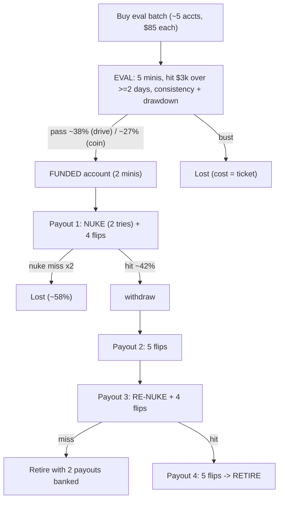
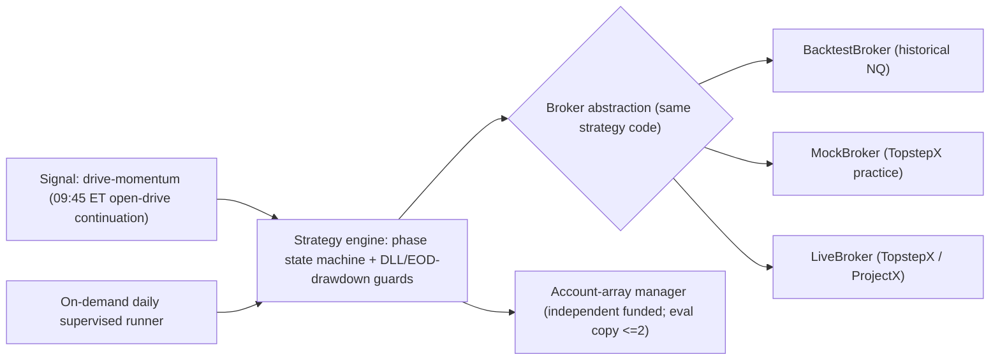

# TopHat NQ Automation - Master Plan and Build Spec

> Status: research/modeling/backtest phase COMPLETE. Configuration locked. Moving to build.
> Models: [monte_carlo.py](c:\Users\Rayyan Khan\Desktop\Project TopHat\monte_carlo.py) (pipeline EV/ruin) and [backtest.py](c:\Users\Rayyan Khan\Desktop\Project TopHat\backtest.py) (measured win rates), fed by [data_loader.py](c:\Users\Rayyan Khan\Desktop\Project TopHat\data_loader.py).

## 1. Objective

Automate a multi-account NQ futures pipeline against Topstep using the official TopstepX / ProjectX API. Buy batches of evaluation accounts, convert passers to funded accounts, and harvest withdrawals. Topstep permits algorithmic trading, multiple accounts under one identity, and native copy trading, so this uses sanctioned features. (Confirm against the current account agreement - see Open Questions.)

## 2. Strategy Thesis (the edge is structural, not predictive)

Profit comes from a structural asymmetry: a cheap eval ticket (~$85) converts into a funded account that can pay out multiples of that ticket, while a blown account only costs the ticket. The Monte Carlo shows the pipeline is net-positive even at a pure coin-flip (zero edge). A real trading edge improves consistency and magnitude, not the sign of the EV. The dominant risk is therefore NOT signal quality - it is whether the funded withdrawal machine survives contact with Topstep's real rules and enforcement (see Risks).

## 3. Instrument & Sizing

- Ticker: NQ (E-mini Nasdaq 100). Tick 0.25 = $5.00. Point value $20.00/contract.
- Position sizing (does NOT change barrier probabilities - only the point<->dollar mapping):
  - Eval: 5 minis. 15.5 pt / 9.5 pt = $1,550 win / $950 loss day.
  - Funded: 2 minis. $4,000 nuke target = 100 pts; $1,000 DLL stop = 25 pts (the backtested 1:4 nuke); $150 flip = 3.75 pts.

## 4. FINAL Configuration (locked)

- Account: **50K, WITH DLL** ($85/ticket). Trailing EOD max drawdown $2,000; DLL $1,000.
- Funded strategy: **the 4-payout nuke lifecycle**, then retire (Topstep moves an account to live after ~5 payouts - confirm):
  1. payout 1: NUKE + 4 flips (5 winning days)
  2. payout 2: 5 flips
  3. payout 3: RE-NUKE + 4 flips (gambled only after 2 payouts are banked)
  4. payout 4: 5 flips -> retire
- Edge: **drive-momentum** (see 6). Eval gets the signal; funded nuke/flip use it too.
- Automation: **on-demand daily + supervised** (you launch each morning; bot executes that day's per-account plan and flattens; you handle payouts/eval purchases and watch nuke days).
- Batching: eval batches OK (you would copy at most 2 evals); **funded accounts traded independently** (no fleet-wide correlation).

### Why with-DLL beat no-DLL (settled with measured numbers)

The DLL's daily cap gives the nuke a **second chance**: $2,000 room / $1,000 DLL = **2 tries**. Two 1:4 tries beat one 2:1 no-DLL shot at landing the make-or-break first nuke:

| 50K / drive | first-nuke hit | P(ruin) | median end | P(end>start) |
| --- | --- | --- | --- | --- |
| **WITH DLL** | **42%** | **17.3%** | **+$31,875** | **82.7%** |
| no-DLL | 36% | 23.5% | +$27,200 | 76.4% |

(Earlier plan versions wrongly called these "identical" - that was before the mechanics were modeled correctly. Caveat: the 2-try rate is modeled as 1-(1-p)^2 of the backtested single-try rate; the independence of consecutive days is assumed, not yet directly backtested.)

## 5. The Pipeline (state machine)

## 6. The Drive-Momentum Edge (pre-registered, then measured)

- Definition: at 09:45 ET, enter in the DIRECTION of the 09:30-09:45 opening-range move (one trade/day). Pure time-series momentum / opening-drive continuation. Exit = the phase bracket.
- This was the ONE signal that beat its coin-flip control. The mean-reversion "liquidity sweep" and the "opening-range breakout" both showed ~0 edge and were rejected.
- Fills modeled at the NEXT bar's open (no same-bar look-ahead); validated through 1-2 ticks of slippage.

## 7. Measured Win Rates (backtest.py; 251 days, 2025-06 -> 2026-06, 1s bars)

Coin-flip controls reproduce the geometric baselines (engine is unbiased), and drive beats them out-of-sample:

| Bracket (target/stop pts) | No-edge baseline | Coin control | **Drive** | Edge | IS / OOS |
| --- | --- | --- | --- | --- | --- |
| Eval 15.5 / 9.5 | 38.0% | 37.9% | **45.6%** | +7.6pp | 44.0 / 47.2 |
| Flip 7.5 / 50 | 87.0% | 86.6% | **89.2%** | +2.2pp | 88.0 / 90.4 |
| Nuke no-DLL 100 / 50 (2:1) | 33.3% | 33.4% | **36.1%** | +2.7pp | 37.8 / 34.4 |
| **Nuke DLL 100 / 25 (1:4)** | 20.0% | 19.6% | **24.0%** | **+4.0pp** | 25.6 / 22.4 |

- The drive edge is LARGER on the 1:4 nuke (+4.0pp) - directional momentum helps a bigger directional bet more.
- Regime dependence is real: drive was strong Aug-Sep and Mar-May, BELOW baseline Nov-Feb. Carried into the build honestly (no regime filter fitted to one winter).

## 8. Monte Carlo Results (final model; 50K DLL, measured drive edges)

Inputs: eval 46% / flip 89% / nuke-per-try 24% (drive). Budget $1,000, batch 5, 12 rounds, 4-payout lifecycle.

| 50K | eval pass | $/funded acct | mean payouts | batch ROI | P(ruin) | median end | P(end>start) |
| --- | --- | --- | --- | --- | --- | --- | --- |
| DLL / coin | 26.7% | $1,250 | 0.86 | +282% | 40.2% | +$9,716 | 59.6% |
| **DLL / drive** | **38.8%** | **$1,688** | **1.11** | **+668%** | **17.3%** | **+$31,875** | **82.7%** |

Funded-account survival curve (DLL/drive): P(reach payout) 1: 42% -> 2: 40% -> 3: 15% -> 4: 14%. Read: the FIRST nuke decides ~58% of accounts; flip cycles are nearly free; the re-nuke is a coin-flip taken only after 2 payouts are already banked.

The math (driftless): P(hit +a before -b) = b/(a+b). EV is invariant to stop placement; only real drift (edge) changes the sign. Position size cancels out.

## 9. Honest Risks & Model Limitations (audit targets)

- **Topstep enforcement (the true ceiling, UNMODELED):** flagging/closing bot fleets, slippage injection, rule changes, or the live-account move. We mitigate by retiring at 4 payouts and trading funded accounts independently, but this is the biggest unknown.
- **One year of data; drive is regime-dependent** (bad Nov-Feb). Needs more NQ history to validate across regimes.
- **Second-chance independence** is assumed (2 tries = 1-(1-p)^2); a direct two-day nuke backtest would close this.
- **Withdrawal realism:** exact first-payout cap, minimum days to/between payouts unconfirmed.
- **No calendar-time modeling:** rounds are reinvestment cycles, not days. Nuke is fast (~5 days/payout) - chosen partly to AVOID the winning-day pile that flips-only creates (which can trigger the live-account move).
- **No-DLL flip bracket (7.5/100) not backtested** - moot now that DLL is chosen.
- **Path risk:** positive mean EV still loses ~17% of campaigns on a $1,000 bankroll; a larger bankroll (~$5k) drives modeled ruin toward zero.

## 10. System Architecture to Build

Design principles:
- One strategy engine runs unchanged across backtest, mock, and live; only the broker swaps.
- Async Python (asyncio, websockets/SignalR). Market entry; OCO bracket (limit target + stop-market) for exits.
- Phase detected from API balance/state on startup: eval -> funded(payout-cycle index) -> nuke vs flip.
- Per-account lifecycle counter drives nuke (cycles 1 & 3) vs flip (cycles 2 & 4), retire at payout 4.
- Near-miss handling: within <$10 of target, flatten and log MANUAL_ADJUSTMENT_REQUIRED rather than re-entering.
- Supervised: the runner stages the day's orders; nuke days surface for human confirmation (per chosen automation posture).

## 11. Build Phases

DONE: (1) data ingestion, (2) backtest harness + coin-flip control, (3) measured win rates, (4) signal selection (drive).

NEXT:
5. ~~**Strategy engine + risk guards**~~ DONE (`engine.py`, validated via `pipeline.py`).
6. ~~**ProjectX/TopstepX broker backend**~~ DONE (`broker/projectx/`, `probe.py`). REST auth, accounts, NQ contract, bracket orders, drive-from-bars. SignalR user hub is a follow-up.
7. ~~**On-demand daily supervised runner**~~ DONE (`runner.py`, `state_store.py`). Dry-run default; `--execute` places orders; nukes need `--confirm-nukes`.
8. **Practice-account forward test** (eval / flip / nuke) vs backtest to check overfitting and exercise live code.
9. **Go/no-go review**; then ONE live account before scaling the array.

### Daily automation workflow (supervised)

1. Copy `.env.example` → `.env` with your ProjectX username + API key ([auth docs](https://gateway.docs.projectx.com/docs/getting-started/authenticate/authenticate-api-key)).
2. Each morning after 09:45 ET: `python probe.py` (sanity check) then `python runner.py` (dry-run).
3. Review the per-account plan. Nuke days require explicit `--confirm-nukes`.
4. To fire: `python runner.py --execute` (flips/eval) or `python runner.py --execute --confirm-nukes` (includes nukes).
5. State persists in `data/account_states.json` across sessions.

## 12. Open Questions (confirm before/while building)

- TopstepX / ProjectX API specifics: REST base + SignalR hubs, auth, order/bracket endpoints, account/balance polling, rate limits.
- Exact funded payout rules: first-payout cap, minimum days to first payout, minimum days between payouts, required buffer.
- Confirm the live-account trigger (assumed ~5 payouts) so the 4-payout retire is correct.
- More NQ history (2+ years) to validate drive across regimes and run a direct two-day-nuke backtest.
